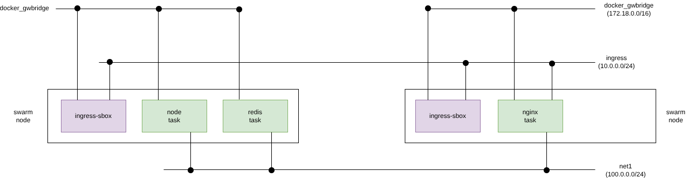

# Description

For this example, I have a very simple Node.js applications that increments a counter stored on Redis. I want to run Redis and the node application independently as I want to have the ability to scale the node application depending on the load. To start off, I have 3 instances of the node server running the application. I have an Nginx server in front of node for load balancing the node instances.

Let’s now talk in terms of containers, specifically Docker containers. Simple; 1 container for each service/process!

1 Redis container
3 Node containers
1 Nginx container

So, the overall picture looks something like this:


 I could build the container from scratch using Docker commands, but to make it easier I wrote a Dockerfile which would build the container for me. I also use Docker Compose to compose the application linking the containers.

 ## Deploy Docker Standalone

We will use a Docker compose yamls descriptor
```
$ docker compose up -d
```

 ## Deploy Docker Swarm
 We must first compile the images for swarm cluster:

```
$ cd node
$ docker build -t ofertoio/node .
$ docker push ofertoio/node

$ cd nginx/swarm
$ docker build -t ofertoio/nginx .
$ docker push ofertoio/nginx
```

Now we must create a overlay network where deploy all tasks(container) from services:

```
$ docker network create --opt encrypted --subnet 100.0.0.0/24 -d overlay net1

$ docker service create --name redis --network net1 redis
$ docker service create --name node --network net1 ofertoio/node
$ docker service create --name nginx --network net1 -p 1080:80 ofertoio/nginx
```

Yjese are all awarm services and tasks


This is the nginx Frontend. If where request each time the swarm balancer will send the requets to other node backend and we can see the 
node name where it come from


Finally we can ñpgon in eedis Database to check the counter key used by node backend to save the value from each request.


If you don't pusblish any port for this service, you can add port mapper at runtime from poprtainer and task selected for example:


 ## Swarm network

Swarm network architecture

