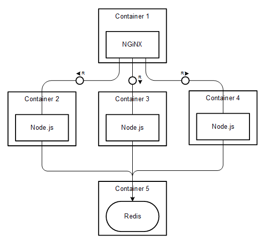

# Description

For this example, I have a very simple Node.js applications that increments a counter stored on Redis. I want to run Redis and the node application independently as I want to have the ability to scale the node application depending on the load. To start off, I have 3 instances of the node server running the application. I have an Nginx server in front of node for load balancing the node instances.

Let’s now talk in terms of containers, specifically Docker containers. Simple; 1 container for each service/process!

1 Redis container
3 Node containers
1 Nginx container

So, the overall picture looks something like this:



 I could build the container from scratch using Docker commands, but to make it easier I wrote a Dockerfile which would build the container for me. I also use Docker Compose to compose the application linking the containers.

 ## Depploy local

```
$ docker compose up -d
```

 ## Depploy local
 ```
$ docker service create stack ...
```