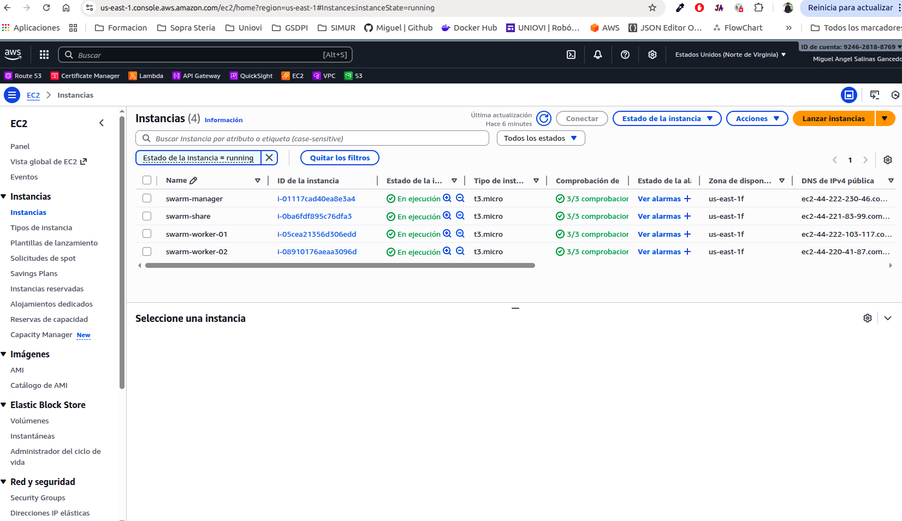

# Description
Use a NFS volume between several tasks in Docker Swarm

## Deploy Docker Swarm in EC2

- **STEP01:** Install NFS Server
    
    We must create a new micro VM to be shared between several services and will install the `nfs-kernel-server` a kernel modules to implement the protocol nfs and execute a server in default port 2049

    ```
    $ sudo apt update

    $ sudo apt install nfs-kernel-server -y
    ```

    Now we muts create a shared folder in the VM with these priviledged and owner
    ```
    $ sudo mkdir -p /mnt/nfsshared
    $ sudo chown nobody:nogroup /mnt/nfsshared
    $ sudo chmod 777 /mnt/nfsshared
    ```

    We must configure the share folders to be publish by the NFS Server
    ```
    $ echo "/mnt/nfsshared 172.31.0.0/16(rw,sync,no_subtree_check)" | sudo tee -a /etc/exports
    ```

    Finally we restart the NFS Server and create a systemctl configuration to start the NFS Server when the VM starts:
    ```
    $ sudo exportfs -ra
    $ sudo systemctl enable --now nfs-kernel-server
    ```

- **STEP-02:** Install NFS Clients

    Now we must install in each cluster Swarm node the NFS Client `nfs-common` and mount the remote volume from NFS Server
    
    Install the NFS Client protocol
    ```
    $ sudo apt install nfs-common -y
    ```

    Mount the remote volume locally
    ```
    $ sudo mkdir /mnt/volume-share
    $ sudo mount -t nfs 172.31.71.255:/mnt/nfsshared /mnt/volume-share
    ```

    After mount the volume the NFS will create a default shared folder inside `/mnt/volume-share` called `nfsshare` shared by all Swarm cluster
    ```
    $ ls -all mnt/volume-share/nfsshare
    ```        

    